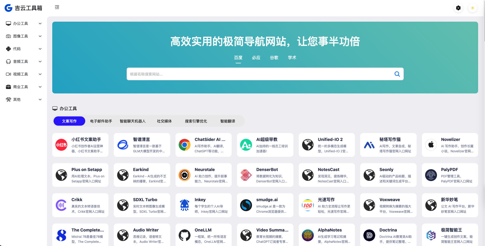
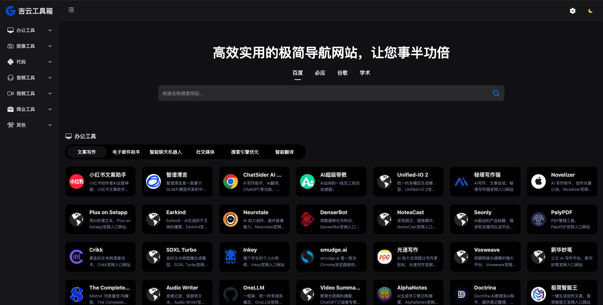

# 开源框架
第三方开源框架的基础上进行搭建的，这是地址[engyun-nav](https://github.com/xsdeyun/gengyun-nav)


吉云工具箱,极简导航,工具网站,导航网站,Ai工具,在线工具,Ai导航,Ai导航网站,Ai工具网站

# 预览地址

[吉云工具箱预览地址](http://utool.ppqsy.top)

# 效果图

1. 开灯模式


2. 暗黑模式



``` bash
npm

# 启动
npm dev

# 打包
npm build
```
